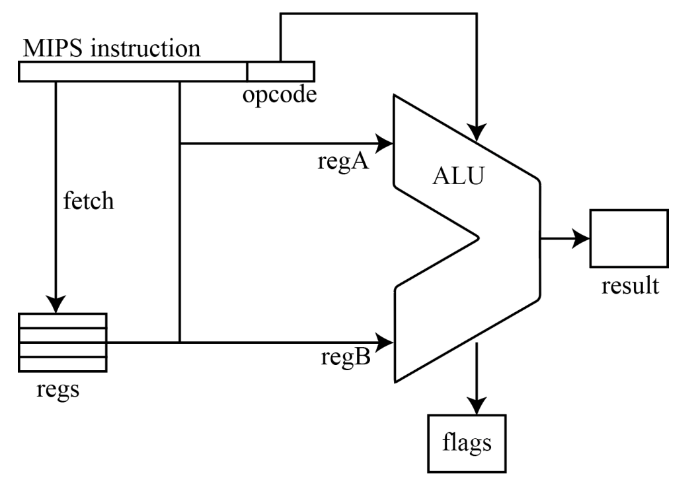
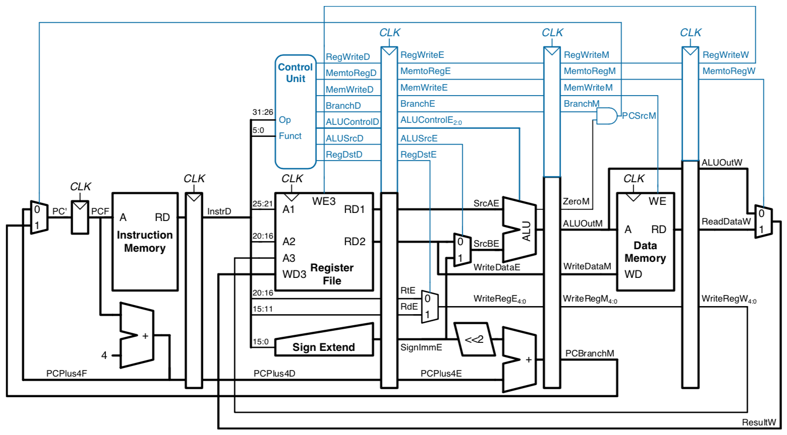
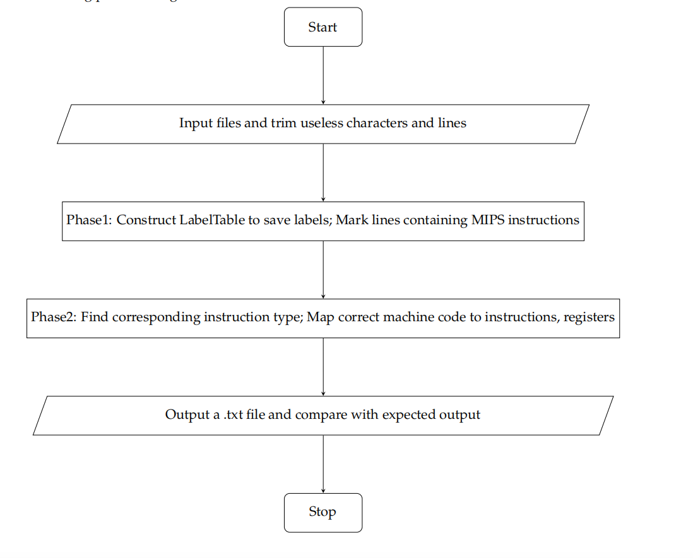
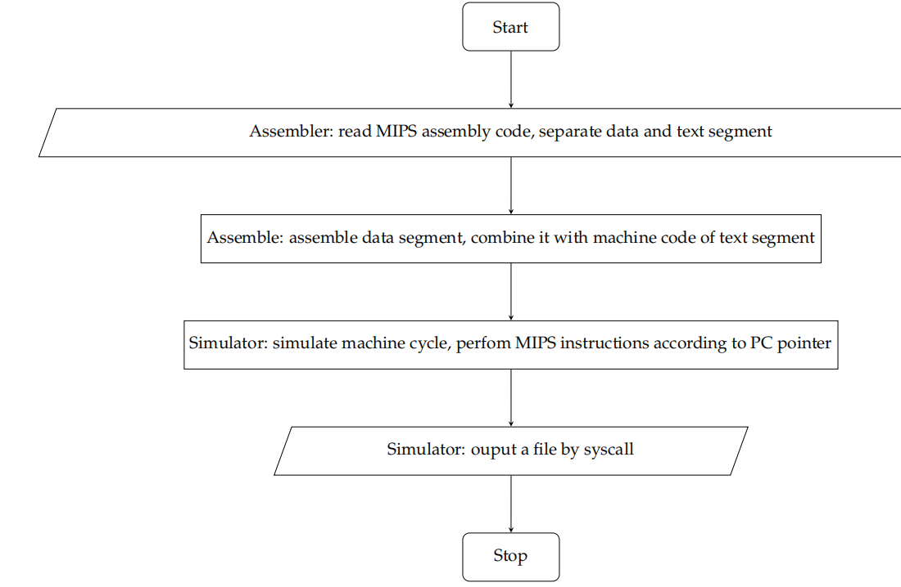

# Computer-Architecture
Computer Architecture projects: MIPS assembler & simulator, 5-staged pipelined CPU

## Verilog
### [Arithmetic and Logic Unit](Arithmetic-and-Logic-Unit)

Arithmetic and Logic Unit (ALU) is an important ocmputation unit in CPU. This project implements a simple CPU which supports simple instruction parsing, Register Value fetching, and ALU functions.  As shown in the diagram below, after parsing the
machine code of MIPS instruction, ALU receives three fixed inputs, opcode(4 bit) , regA (32 bits) , and regB (32 bits) , and outputs two signals, result (32 bits) and flags (3 bits).



### [5-staged_pipelined_CPU](5-staged_pipelined_CPU)
This project implements a 5-stage pipelined CPU. Basically, it supports
instruction fetch (IF), instruction decode and register read (ID), excute or calculated address (EX), access data memory (MEM), write back to register (WB). It solved [Hazards](5-staged_pipelined_CPU/Pipeline&Harzards.pptx) by handlers such as NOP and Data Foward, the program did some change on the orignal diagram. The pipelined diagram is shown as below:


## C++
### [MIPS_Assembler](MIPS_Assembler)
Background: Machines cannot understand high level programming languages directly, such as C/C++/JAVA. High level programming languages are "translated" to machine instructions that machine can understand. Assembly languages, including MIPS we deal with, are the readable (although difficult) version of machine code. In assembly languages, one [instruction](MIPS_Assembler/MIPS%20Instruction%20List.pdf) tells the computer to do one thing exactly. For example, an instruction
may look like this:
```
add $t3, $t1, $t2
```

This instruction tells the computer to add up the things stored in register $t1 and register $t and store the result in $t3. Here, registers are small chunks of memory in CPU used for program execution. The MIPS assembly language has three types of instruction in general: I-type, R-type, and J-type, each corresponds to
a pattern of the 32 bits of machine code. Details can be found in Appendix A of the text book. The above instruction has the machine code:
```
00000001001010100100000000100000
```

This project implements a MIPS assembler. It translates MIPS code to its corresponding machine code. The MIPS assembly language has three types of instruction in general:
R-type, I-type and J-type. Each instruction and register has their own 01 sequence. Therefore, the main idea is to implement a function that can realize this one-to-one mapping relationship. There
are several challenges of this task:
1. Find a proper data struture to realize the mapping relation.
2. Identify and classify the type of MIPS.
3. Ignore the comments after the line of code or in a whole line.
4. Store the address of the label and compute absolute and relative address.
5. Deal with empty spaces, tabs and empty lines.
   
The big picture thoughts and ideas are as followed:



Excute the program:
```
make
./tester ${input file}$ ${output file}$
```


### [MIPS_Simulator](MIPS_Simulator)


This project implement a MIPS  simulator that simulates the execution of a binary file(machine code generated by MIPS assembler). The program supports all instructions and data types in [MIPS instruction list](MIPS_Assembler/MIPS%20Instruction%20List.pdf). System call functions are implemented by using POSIX APIs. To simulate main memory(stack, data, text, reserved), program dynamically allocates a block of memory with 6MB. It also simulate 32 general registers such as $gp, $sp and $ra. The code maintain a PC, which points to the first line of code in the simulated memory. It has a major loop, simulating the machine cycle.  
There are several challenges of this task:
1. Store data segment in proper byte order and in a way to load or store byte, half, word easily.
2. Design proper structure for memory, register and PC pointer.
3. Call MIPS functions according to machine code. Design function to imitate MIPS functions.
4. Design function to imitate MIPS syscall, which invokes the Linux APIs.
5. Imitate machine cycle and manage the change of PC pointer after each execution.
Since simulator should only simulate but not assemble, the code designs two class: Assemblerand Simulator. 

The big picture thoughts and ideas are as followed:


Excute the program:
```
make
./simulator ${MIPS file}$ ${machine code file}$ ${checkpts file}$ {input file}$ ${output file}$
```